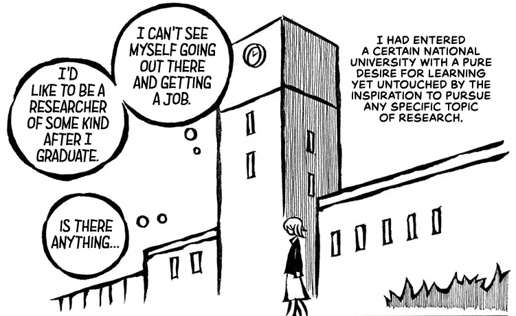
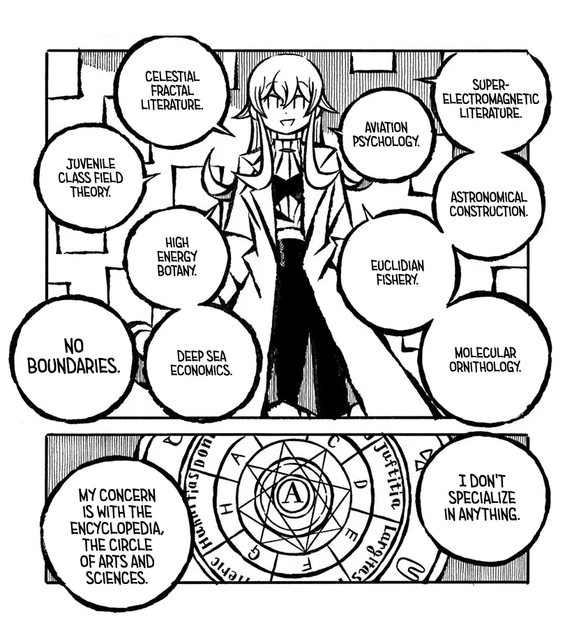
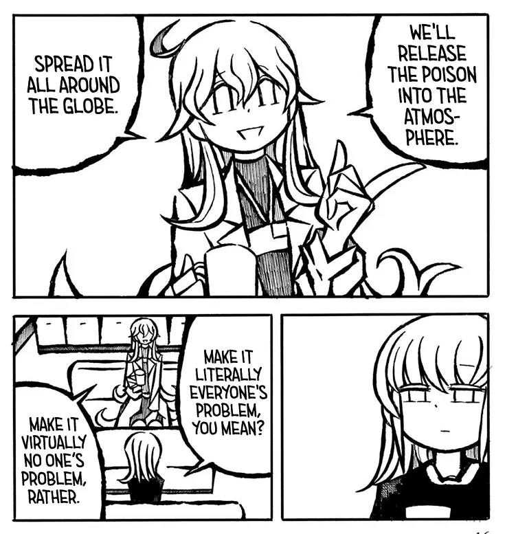
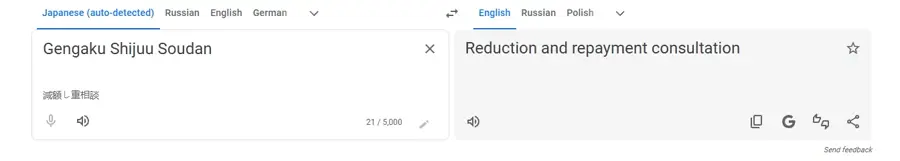

I found this manga when I was scrolling through recomendations on MyAnimeList. Luckely, every time I
do it I find some relatively unknown but nonetheless interesting things to read. This manga is no 
exception.

It's about everyday interactions between the girl who becomes an assistant to a professor whom place
she wants to take eventually. She recently entered university and doesn't really know what she wants
to do or research. Later in the series while discussing little sisters she says that she grew up to
be dull, with no passion for anything particular.

Her teacher is sort of a mad scientist that always brings some chaos to the story. She's a 
researcher that works at the university, she gets significant funding but doesn't give any lectures.
What is she researching? Well...

By the way, her goal is the restoration of the human soul.

This manga works becacause of the interactions between the two. It's basically a sitcom. The teacher
shares an absurd idea or brings up some criminally dangerous research topic of hers and the girl
tries to comprehend what she just heard or what happened has to her.

That's not the only great thing about this manga. (TODO: she starts to trust her and strive to 
become like her despite often being a guinea pig for her experiments)

Lastly, as for the name of the manga... I don't know exactly what is means and so I left it in the
title as is. I couldn't find its english translation and Google Translate didn't help either.

