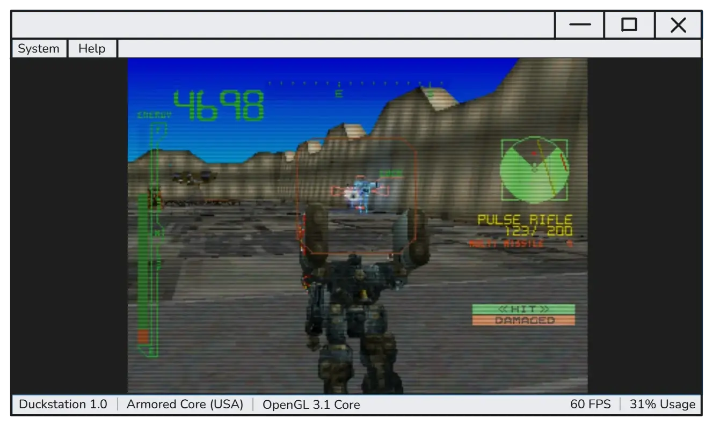
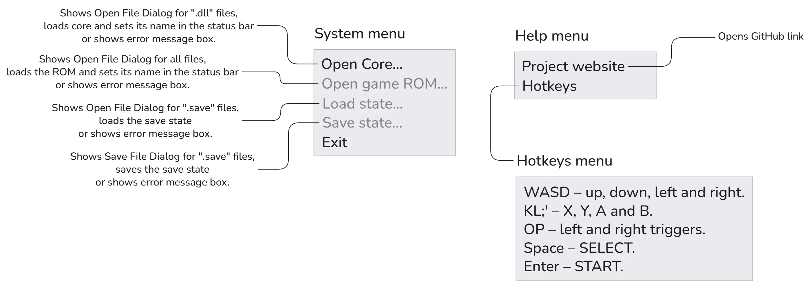
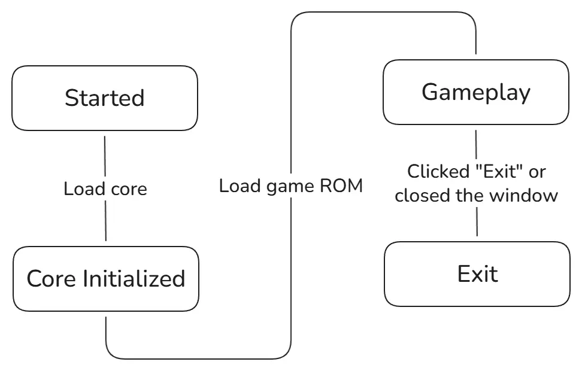

A while back I wrote a simple Libretro frontend using SDL which I used to play Armored Core 1 with 
mouse support. It had issues with saving and loading game state, it ran at ~20 FPS when 60 was 
expected (because it used software rendering) and it often crashed due to thread synchronization 
issues. It also didn't have any user interface and so you couldn't change any core settings or 
hotkeys.

For this project I wanted to make a more general purpose frontend with decent user interface, better
support for hardware rendering and plugins, written in Lua.

Also this is the first time for me actually writing down any kind of design document, so it should 
be a good learning oppotrunity.

So, what features do I want?

# MVP or version 1.0

This version is supposed to have the most minimal set of features required to run a Retro core
except also supporting hardware rendering.

Constraints/Requirements:
- Support 64-bit Windows 10 only.
- Use OpenGL 3.3 Core profile for rendering.
- Keep executable small.
- Don't allocate memory during runtime unless it is absolutly necessary.

Features:
- Choosing which Libretro core to use.
- Opening game ROM and beginning emulation immedietly after.
- Choosing save files to create or load.
- Showing emulation frame budget (actual frame time divided by expected time).
- Using OpenGL for hardware rendering or software rendering as a fallback.
- Letterboxing.

Emulator interface:
- Toolbar
  - System
    - Open Libretro core
    - Open game ROM
    - Load state
    - Save state
    - Exit
  - Help
    - GitHub link
    - About
- Viewport
- Status bar
  - Libretro core name
  - Loaded game ROM file name
  - Rendering method
  - FPS
  - Frame budget

This is how it's supposed to look:





The lifecycle of the app is super simple:



# First Steps

I started setting up the project a little earlier without much thought to it. I decided to opt out 
of using CMake this time after reading [an article][article] about not using CRT in Windows apps and
it kind of inspired me a little. I wonder if there's xkcd comic about this. I also remembered how I 
compiled RAD debugger for the first time. You type `build` and it works. Just like that. No need for 
multiple `CMakeLists.txt` and presets. I am not planning to compile this project for anything but 
Windows anyway and I doubt it would benefit significantly from incremental builds.

So I spent about 2 to 3 hours trying to make my program compile with `/nodefaultlib` set and make 
`build.bat` print build time and artifact size. Now my ~350 LoC program builds in less than a second
from scratch.

```
----- Compiling "dist" -----
unity.c

Size: 6144 bytes
Time: 0.89 seconds
```

If I didn't include `windows.h` and declared every WinAPI function by hand it would be even faster.
Though it's not like this matters much but still, seeing numbers go up makes my brain tickle.

I thought about using `stb_sprintf` instead of one from the standard library but instead I wrote my 
own in about 100 LoC. I didn't think it could be that simple. From this point I'll try to use as few
external libraries as possible.

I think one problematic part of this project is my intent to implement UI using
Windows Controls that have (as I see it) quite bizarre API. I'll try to abstract it as much as I 
can. Another part is outputting sound. Libretro cores use push model for providing audio samples to 
the host application. I don't know yet which interface I will use: DirectSound or WASAPI, as I don't
have any experience with either of them.

For now I'll experiment with file dialogs, implement basic core loader and begin tinkering with 
Controls library.

[article]: https://nullprogram.com/blog/2023/02/15/

# The Following Commit

I was a little bit curious about whether I actually need `windows.h` or not. I ran the following
commands to figure out how many lines of code it added:

```py
from os import system
open('tmp.h', 'w').write('#include <windows.h>')
flags = [
    '/D', 'WIN32_LEAN_AND_MEAN', '/D', 'NOMINMAX', '/D', 'NOGDICAPMASKS', '/D', 'NOSYSMETRICS',
    '/D', 'NOMENUS', '/D', 'NOICONS', '/D', 'NOKEYSTATES', '/D', 'NOSYSCOMMANDS',
    '/D', 'NORASTEROPS', '/D', 'OEMRESOURCE', '/D', 'NOATOM', '/D', 'NOCLIPBOARD', '/D', 'NOCOLOR',
    '/D', 'NODRAWTEXT', '/D', 'NONLS', '/D', 'NOMEMMGR', '/D', 'NOMB', '/D', 'NOMETAFILE',
    '/D', 'NOOPENFILE', '/D', 'NOSCROLL', '/D', 'NOSERVICE', '/D', 'NOSOUND', '/D', 'NOTEXTMETRIC',
    '/D', 'NOWH', '/D', 'NOWINOFFSETS', '/D', 'NOCOMM', '/D', 'NOKANJI', '/D', 'NOHELP', '/D',
    'NOPROFILER', '/D', 'NODEFERWINDOWPOS', '/D', 'NOMCX', '/D', 'NOCRYPT', '/D', 'NOIME',
    '/D', 'WINVER=_WIN32_WINNT_WIN7', '/D', '_WIN32_WINNT=_WIN32_WINNT_WIN7',
    '/D', '_WIN32_WINNT_WIN10_TH2=0', '/D', '_WIN32_WINNT_WIN10_RS1=0',
    '/D', '_WIN32_WINNT_WIN10_RS2=0', '/D', '_WIN32_WINNT_WIN10_RS3=0',
    '/D', '_WIN32_WINNT_WIN10_RS4=0', '/D', '_WIN32_WINNT_WIN10_RS5=0',
]
system(f'cl.exe /nologo {" ".join(flags)} /E tmp.h > 1.txt')
len(list(filter(lambda l: not l.isspace(), open('1.txt').readlines())))
```

The result is **31737** lines of code. 85717 without `NO*` flags.

So I decided to not include anything but my own headers. At least to try.

In the process I redefined `stdarg.h`. One thing I don't really understand is where `__va_start`
comes from. `dumpbin /imports` doesn't show it so I guess it's a compiler intrinsic. Every Windows
function or type I use is now in `miniwindows.h` declared the same way as in original header so I 
could swap them if I need to. At the moment it's a nice and small ~160 LoC header file.

Doing this sped up the build time from **0.9** seconds to **0.47** and also allowed me to remove 
that wall of defines in the build file. I haven't tried to use different linker so there might be 
room for improvement. Later I'll try to remove dependency on `vcruntime140.dll` which only exports 
`memset`. I think I can just use `RtlFillMemory` or steal implementation from SDL.
